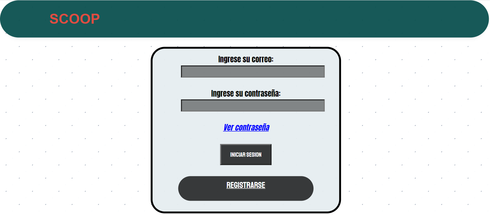
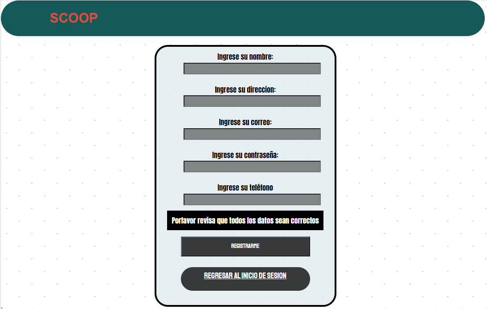
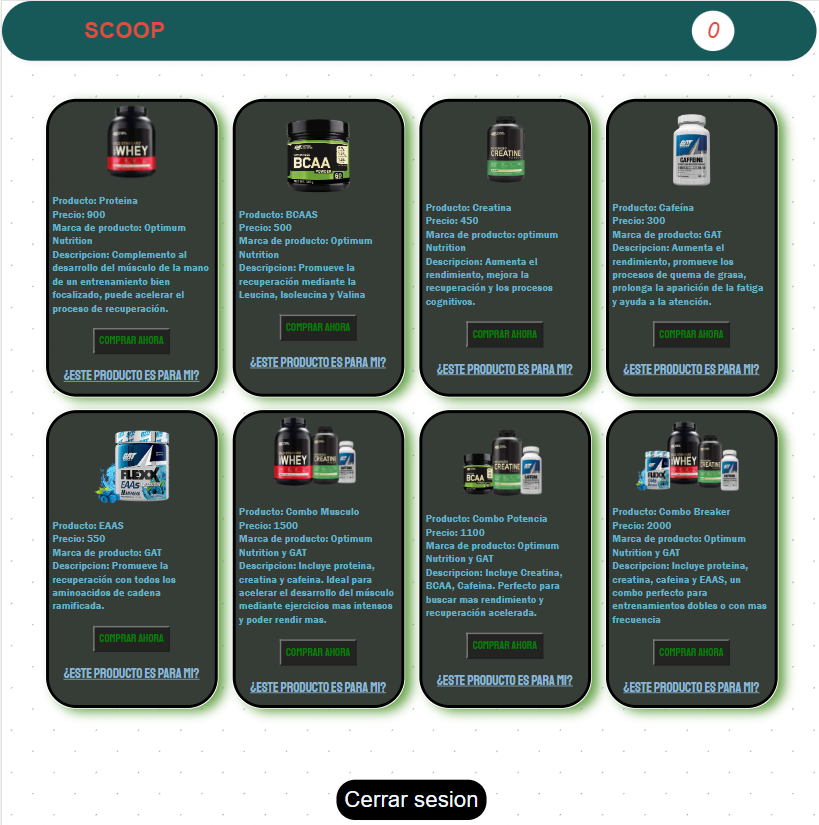
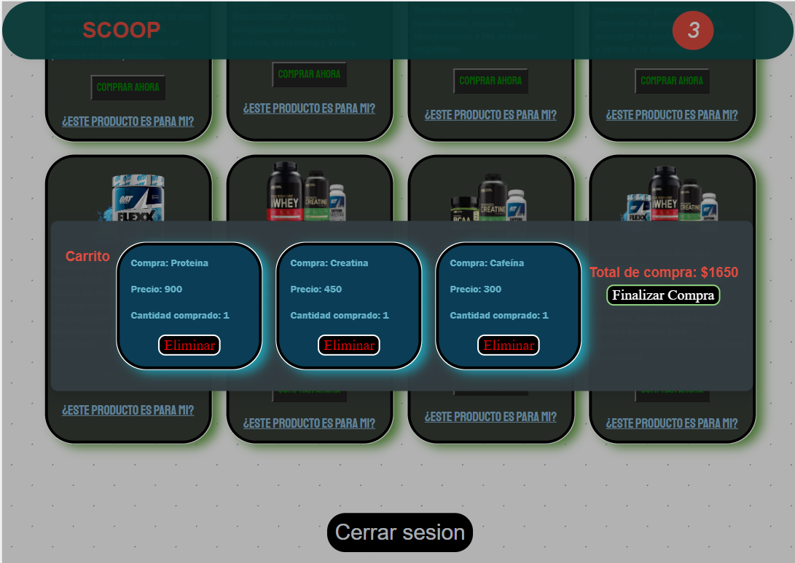

# SCOOP

Scoop was my first coding proyect, I have so much feelings for this project because I was learning to do my first steps on using the tools that I will describe

 
     
     
     

## Project views

## Things learnt with this project

- Functions

- Arrays

- Storing products

- JSON local storage

- JSON session storage

- JSON Stocking items

- Iterating with DOM

- DOM interactions

- Async-Await

- Toastify JS library

- Sweet Alert library

- Timeouts

- Log In - Register structure

- Basic UI 
